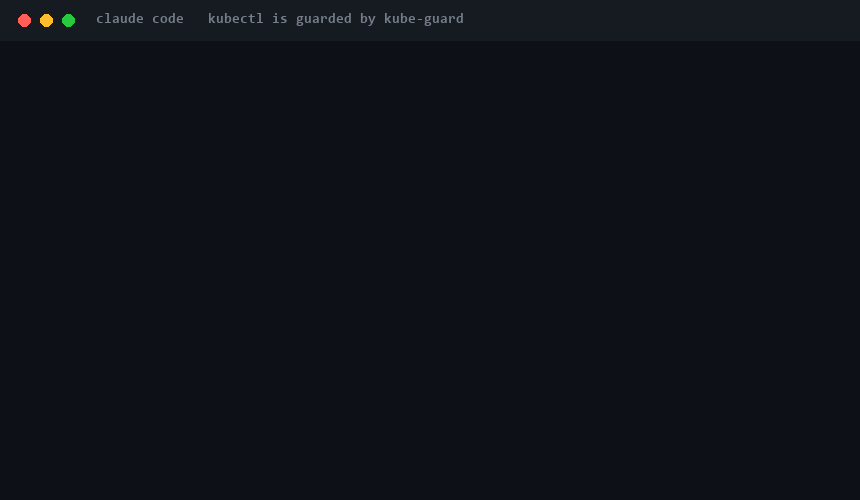

<div align="center">

# 🛡️ kube-guard

**Give your Claude Code agent `kubectl` — with a seatbelt.**

A PreToolUse hook that classifies every `kubectl`/`helm` command by blast radius and **allows, asks, or denies** it before it runs. Reads flow through; production deletes don't.

[](LICENSE)


</div>

<p align="center">
  
</p>

---

## The problem

An AI agent with `kubectl` access is one hallucinated command away from `kubectl delete namespace prod`, a `drain`, an `apply` to the wrong context, or a `get secret -o yaml` that leaks credentials into the transcript. Permission prompts help — until you run in `acceptEdits` or `--dangerously-skip-permissions` and rubber-stamp everything.

> *"Your AI agent should not have direct kubectl access."* — and yet you want it to help.

## The solution

`kube-guard` is a pure Claude Code plugin (hook + skill + command, zero dependencies) that sits in front of the agent's shell. Every Bash command is parsed; any `kubectl`/`helm` invocation is classified and gated:

| Class | Examples | Default verdict (`strict`) |
|---|---|---|
| **READ** | `get`, `describe`, `logs`, `top`, `rollout status`, `helm list` | ✅ **allow** |
| **WRITE** | `apply`, `scale`, `patch`, `edit`, `rollout restart`, `helm upgrade` | ⚠️ **ask** (confirm) |
| **DESTRUCTIVE** | `delete`, `drain`, `taint`, `replace --force`, `helm uninstall` | 🛑 **deny** |
| **HIGH-RISK** | `exec`, `run`, `cp`, `port-forward`, `config view`, `get secret -o yaml` | 🛑 **deny** |

Plus cross-cutting guards: **protected contexts/namespaces** (anything matching `prod`, `production`, `*-prod`, `kube-system`, …) escalate every mutation to **deny**, and the guard **fails closed** — if it can't verify a command (`eval`, pipe-to-shell, subshells, unknown verbs), it asks or denies rather than guessing.

```text
agent → kubectl delete ns prod   →  🛑 DESTRUCTIVE on protected context — denied (logged)
agent → kubectl apply -f d.yaml  →  ⚠️ WRITE — asks you to confirm
agent → kubectl get pods         →  ✅ READ — allowed
```

## Install

```text
/plugin marketplace add andresleecom/kube-guard
/plugin install kube-guard@kube-guard
```

Requires `kubectl` on your PATH (which you already have). Zero npm dependencies.

## Why it's different

It **gates execution**, even when you've turned permissions off:

- A `deny`/`ask` from kube-guard applies **regardless of permission mode** — even with `--dangerously-skip-permissions`, a protected-context delete still stops.
- It catches kubectl **anywhere** in a command (`cd x && kubectl delete …`, env-prefixes, pipes), not just as the first word.
- It resolves your **current context** so guards work even when the command omits `--context`.
- Every decision is written to a private, gitignored **audit log** (`.claude/kube-guard/audit.jsonl`), with secrets redacted.

| | kube-guard | k8sgpt | kagent | KubeShark (skill) |
|---|:--:|:--:|:--:|:--:|
| Gates command **execution** (allow/ask/deny) | ✅ | ❌ (read-only diag) | ❌ (RBAC only) | ❌ (advisory) |
| Protected-context / blast-radius guard | ✅ | ❌ | ❌ | ❌ |
| Per-context policies (multi-cluster) | ✅ | ❌ | ❌ | ❌ |
| Temporary context leasing (prod for 1 cmd / N min) | ✅ | ❌ | ❌ | ❌ |
| Blocks secret dumps & exec | ✅ | n/a | ❌ | ❌ |
| Works in IDE, no in-cluster agent | ✅ | ✅ | ❌ | ✅ |
| Audit log | ✅ | ❌ | partial | ❌ |
| Zero dependencies | ✅ | ❌ | ❌ | ✅ |

## Configuration

Config is **layered** (later wins): plugin defaults → `~/.claude/kube-guard.config.json` (global, every project) → `<project>/.claude/kube-guard.config.json` → `KUBE_GUARD_MODE` env. Set a posture once, globally, and it holds everywhere.

### Levels (postures)
Every command is judged at the level of its **target context** (the `--context` flag, or your live current context):

| Level | Reads | Writes | Destructive | High-risk |
|---|:--:|:--:|:--:|:--:|
| `readonly` | allow | **deny** | deny | deny |
| `strict` *(default)* | allow | ask | deny | deny |
| `standard` | allow | ask | ask | deny |
| `audit` | allow | allow | allow | allow *(logged)* |

### Multiple clusters → per-context policies
Different clusters, different postures. Map context globs to levels:

```jsonc
// ~/.claude/kube-guard.config.json
{
  "defaultMode": "strict",
  "contextPolicies": [
    { "match": ["*prod*", "*live*", "my-prod-cluster"], "level": "readonly" },
    { "match": ["*stag*"],                              "level": "strict"   },
    { "match": ["kind-*", "minikube", "*dev*"],         "level": "audit"    }
  ],
  "protectedNamespaces": ["kube-system", "prod", "*prod*"],
  "allowExec": false,        // set true to downgrade exec/cp/run from deny → ask
  "allowSecretRead": false   // set true to downgrade secret dumps → ask
}
```
Unlisted contexts fall back to `defaultMode`. Legacy `protectedContexts` (a flat list) still works and maps to `readonly`.

### Switch & lease (multi-cluster, safely)
- **`/kctx`** — list contexts with their level and switch safely; kube-guard **confirms when you enter a guarded cluster** and lets dev/local through freely. Solves the "I thought I was on staging but I was on prod" footgun.
- **`/klease`** — the **context leash**: temporarily relax a `readonly` (prod) cluster for **one command** or **N minutes**, then it **auto-reverts**. Lease only the exception you need:
  ```bash
  # prod, but writable (with confirmation) for the next single command:
  node "$CLAUDE_PLUGIN_ROOT/scripts/lease.mjs" my-prod-cluster --once --level strict
  ```

Inspect anything with **`/kube-guard`** (active policy + recent decisions), or dry-run a command:
`node "$CLAUDE_PLUGIN_ROOT/scripts/explain.mjs" "kubectl delete ns prod"`.

## FAQ

**Does it slow down every Bash command?** Negligibly — the hook fast-exits unless the command contains `kubectl`/`helm`.

**What if kube-guard itself errors?** It fails closed: an internal error returns `ask`, never a silent allow.

**Can the agent bypass it?** Obfuscation (`eval`, `| sh`, `$(...)`, base64, unknown verbs) is treated as unverifiable and denied/asked.

**Does it send anything anywhere?** No. Everything is local; the only outbound calls are the kubectl reads you'd run anyway.

**Windows?** Yes — pure Node.js hooks, no bash/jq.

## Security

See [SECURITY.md](SECURITY.md) for the threat model. kube-guard is a guardrail, not a sandbox: it reduces blast radius but does not replace Kubernetes RBAC. Combine it with least-privilege credentials.

## Roadmap

- [ ] GitOps remediation: propose fixes as reviewable PRs instead of mutating the cluster.
- [ ] Cost / right-sizing recommendations with dollar impact.
- [ ] Incident loop: triage → fix → PR → postmortem.
- [ ] `require dry-run + diff` before apply; guard `Write`/`Edit` of dangerous manifests.
- [ ] Blast-radius preview before destructive ops (count affected resources).
- [x] Per-context policies & multi-cluster awareness (v0.2.0).
- [x] Context leasing — temporary, auto-reverting prod access (v0.2.0).

## Contributing

Issues and PRs welcome. The plugin is deliberately small and dependency-free — the classifier (`scripts/classify.mjs`) is pure and covered by `node --test`. Add a failing case to `test/classify.test.mjs` first.

## License

[MIT](LICENSE) © Andres Lee
